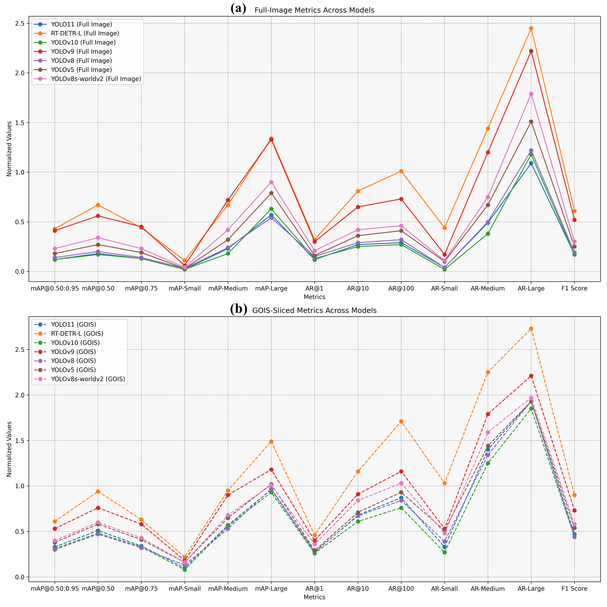

### License

[**MIT License**](LICENSE) - All rights reserved to the author. This project may be used for study and educational purposes, but **redistribution, redevelopment, or use of the code for personal or commercial purposes is strictly prohibited without the author's written consent.**
# Enhancing Tiny Object Detection Without Fine-Tuning - Guided-Object Inference Sclicing (GOIS) Novel Framework
**Dynamic Adaptive Guided Object Inference Slicing Framework with Latest YOLO Models and RT-DETR Transformer**\
**Applied on High Quality Images/Low Quality Mobile Camera Images/Apply GOIS on Video/ Apply Inside Live Camera**\
By: Muhammad Muzammul, Xuewei Li, Xi Li \
-> Research Paper also Underreview in  Journal 
<a href="https://www.sciencedirect.com/journal/neurocomputing">Nurocomputing</a>

### Citation, Preprint Available  
```bash
@ MUHAMMAD MUZAMMUL, Xuewei LI, Xi Li et al.  
Enhancing Tiny Object Detection without Fine Tuning:  
Dynamic Adaptive Guided Object Inference Slicing Framework  
with Latest YOLO Models and RT-DETR Transformer,  
07 January 2025, PREPRINT (Version 1) available at Research Square  
[https://doi.org/10.21203/rs.3.rs-5780163/v1]
```

<table>
  <tr>
    <td colspan="2">
      Tiny Object Detection (TOD) in high-resolution imagery poses significant challenges due to issues like low resolution, occlusion, and cluttered backgrounds. The **Guided Object Inference Slicing (GOIS)** framework addresses these challenges with a novel **two-stage hierarchical slicing strategy**. By dynamically reallocating computational resources to Regions of Interest (ROIs), the framework enhances detection precision and efficiency, achieving **3–4× improvements** in key metrics such as Average Precision (AP) and Average Recall (AR).
    </td>
  </tr>
  <tr>
    <td>
      
    </td>
    <td>
      <ul>
        <li><b>Benchmarks Results:</b>  
        Directly download Benchmarks & Evaluate by STEP# 6&7.Results FI-Det, GOIS-Det COCO .json already available at <a href="https://github.com/MMUZAMMUL/TinyObjectDetection-GOIS">GOIS Benhmarks Repository</a>.</li>
        <li><b>Live Demo:</b>  
        Watch the complete live demonstration on:  
          <ul>
            <li><a href="https://www.bilibili.com/video/BV1jJCFYGEY4/?share_source=copy_web&vd_source=410cbe7831c2ac19912dbaf41a99fc47">Watch Video-Bilibili</a></li>
            <li><a href="https://youtu.be/T5t5eb_w0S4">Watch Video-YouTube</a></li>
            <li><a href="data/dataset.md">Data download instructions</a></li>
            <li><a href="https://drive.google.com/drive/folders/12rsLCoPL_7w_oGKurWoDJ8gH1yQ77KJh?usp=drive_link">15% Dataset of VisdroneTrainDet2019</a></li>
            <li><a href="https://drive.google.com/file/d/1a2oHjcEcwXP8oUF95qiwrqzACb2YlUhn/view">Full-Dataset link Visdrone2019</a></li>
          </ul>
        </li>
      </ul>
    </td>
  </tr>
      </table>
More details for Understanding-"Click-arrow"
     <details> 
      <h3>Highlights</h3>
      <ul>
        <li><b>Adaptive Slicing:</b> Mitigates boundary artifacts and optimizes computational efficiency by reallocating resources dynamically.</li>
        <li><b>Architecture-Agnostic:</b> Integrates seamlessly with diverse state-of-the-art detection models (YOLO11, RT-DETR-L, YOLOv8n, etc.) without requiring retraining.</li>
        <li><b>Validated Results:</b> Evaluated on the VisDrone2019-DET dataset, low-resolution imagery, video streams, and live camera feeds, proving its robustness in real-world scenarios.</li>
        <li><b>Significant Improvements:</b> Enhances small and medium-sized object detection by **50–60%**, while maintaining high efficiency and precision.</li>
         <li><b>Apply on different DataType:</b> Apply on High Quality Images/Low Quality Mobile Camera Images/Apply GOIS on Video/ Apply Inside Live Camera.</li>
      </ul>
    </td>
    <td>
      <h3>Key Features</h3>
      <ul>
        <li><b>Full Inference Predictions (FI-Det):</b> Evaluate models on complete images for baseline metrics.</li>
        <li><b>Guided Object Inference Slicing (GOIS-Det):</b> Dynamically adapt inference slicing for improved detection accuracy, particularly for small objects.</li>
        <li><b>Ground Truth Generation:</b> Generate COCO-style annotations for evaluating detection metrics.</li>
        <li><b>Evaluation Metrics:</b> Assess performance with detailed COCO metrics, including precision, recall, and IoU across object scales.</li>
        <li><b>Upscaled Results:</b> Visualize metrics with upscaled values for enhanced comparison and analysis.</li>
      </ul>
    </td>
  </tr>
</details>
## Sections
  
### **GOIS Test from Scratch: 15% Dataset as per Research Paper VisDroneTrainDet2019**

## Installation

### Clone Repository
```bash
git clone https://github.com/MMUZAMMUL/GOIS.git
cd GOIS
```
## Usage Instructions

### 1. **Download Data**
Follow instructions in [Data-download-instructions](data/dataset.md) to prepare the dataset or directly download the 15% subset:  
[**15% Subset Download Link**](https://drive.google.com/drive/folders/12rsLCoPL_7w_oGKurWoDJ8gH1yQ77KJh?usp=drive_link)

### 2. **Download Models**
Run the script to download required models:
```bash
%cd GOIS/Models
python Models/download_models.py  # OR directly download from Ultralytics and upload in folder
```

### 3. **Generate Ground Truth**
Generate COCO-format ground truth annotations:
```bash
python /content/GOIS/scripts/generate_ground_truth.py \
    --annotations_folder "<annotations_path>" \
    --images_folder "<images_path>" \
    --output_coco_path "/content/GOIS/data/ground_truth/ground_truth_coco.json"
```

### 4. **Run Full Inference**
Declare paths
images_folder="<images_path>"\
model_path="/content/GOIS/Models/yolo11n.pt"\
output_base_path="/content/GOIS/data/FI_Predictions"\
model_type="YOLO"  # YOLO or RTDETR or YOLOWorld\

Perform full image inference:
```bash
python /content/GOIS/scripts/full_inference.py \
    --images_folder "$images_folder" \
    --model_path "$model_path" \
    --model_type "$model_type" \
    --output_base_path "$output_base_path"
```

### 5. **Run GOIS Inference**
can change just putput path-> output_base_path="/content/GOIS/data/gois_Predictions"\
Perform sliced inference using GOIS:
```bash
python /content/GOIS/scripts/gois_inference.py \
    --images_folder "$images_folder" \
    --model_path "$model_path" \
    --model_type "$model_type" \
    --output_base_path "$output_base_path"
```

### 6. **Evaluate Results**
#### Evaluate Full Inference:
```bash
python scripts/evaluate_prediction.py \
    --ground_truth_path ./data/ground_truth/ground_truth_coco.json \
    --predictions_path ./data/FI_Predictions/full_inference.json \
    --iou_type bbox
```

#### Evaluate GOIS:
```bash
python scripts/evaluate_prediction.py \
    --ground_truth_path ./data/ground_truth/ground_truth_coco.json \
    --predictions_path ./data/gois_Predictions/gois_inference.json \
    --iou_type bbox
```

### 7. **Compare Results**
Compare evaluation metrics and calculate percentage improvements:
```bash
python scripts/calculate_results.py \
    --ground_truth_path ./data/ground_truth/ground_truth_coco.json \
    --full_inference_path ./data/FI_Predictions/full_inference.json \
    --gois_inference_path ./data/gois_Predictions/gois_inference.json
```

### 8. **Upscale Metrics**
Visualize results with upscaled metrics:
```bash
python scripts/evaluate_upscaling.py \
    --ground_truth_path ./data/ground_truth/ground_truth_coco.json \
    --full_inference_path ./data/FI_Predictions/full_inference.json \
    --gois_inference_path ./data/gois_Predictions/gois_inference.json
```

---
<<<<<<<< Bellow Parts Code will be available soon

### **GOIS Test for Single Image**
<details>
  <summary><b>Click to Expand</b></summary>

  #### **Run GOIS Inference for Single Image**
  ```bash
  <<Adding code>>
  ```

</details>

---

### **GOIS Test for Multiple Images**
<details>
  <summary><b>Click to Expand</b></summary>

  #### **Run GOIS Inference for Multiple Images**
  ```bash
    <<Adding code>>
  ```

</details>

---

### **GOIS Test for Low-Resolution Mobile Camera Images**
<details>
  <summary><b>Click to Expand</b></summary>

  #### **Run GOIS Inference**
  ```bash
    <<Adding code>>
  ```

</details>

---

### **GOIS Test for Video**
<details>
  <summary><b>Click to Expand</b></summary>

  #### **Process Video Using Full Inference**
  ```bash
    <<Adding code>>
  ```

  #### **Process Video Using GOIS**
  ```bash
  <<Adding code>>
  ```

</details>

---

### **GOIS Test for Live Camera**
<details>
  <summary><b>Click to Expand</b></summary>

  #### **Run Live Inference**
  ```bash
    <<Adding code>>
  ```

</details>

---

## Contact
Author: **Muhammad Muzammul**  
PhD Scholar-College of Computer Science and Technology, Zhejinag University,China.\
Email: [muzamal@zju.edu.cn](mailto:muzamal@zju.edu.cn)  
Email: [munagreat123@gmail.com](mailto:munagreat123@gmail.com)  

## Contributing
Read the [Contributing Guidelines](CONTRIBUTING.md) for more details.

## License
This project is licensed under the MIT License. See [LICENSE](LICENSE) for details.

## Security
For reporting vulnerabilities, refer to [SECURITY.md](SECURITY.md).

---
